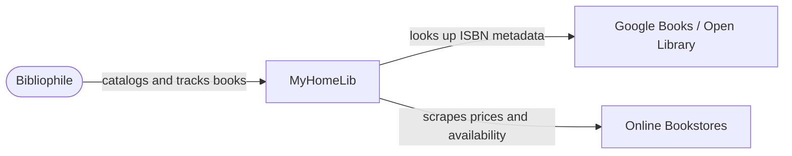
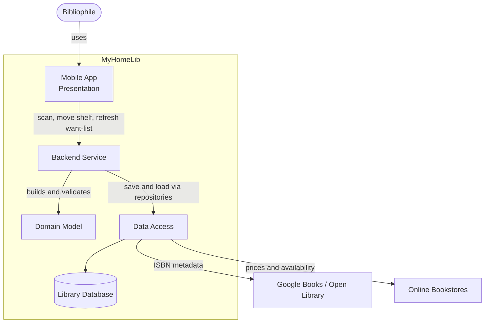
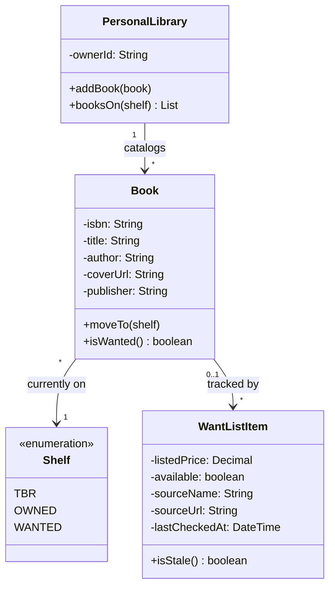
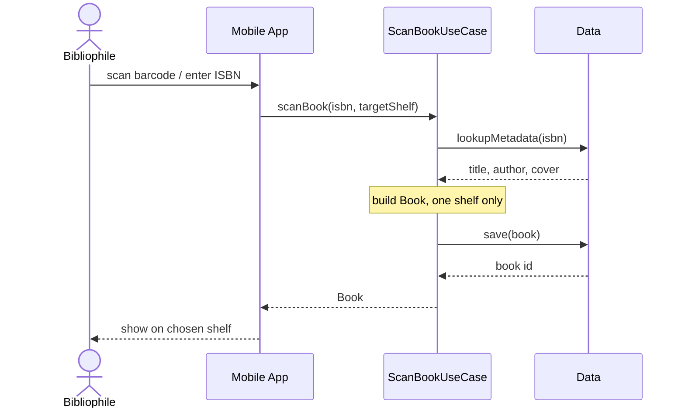

# MyHomeLib

<!-- CI badge: after Session 4, replace ORG/REPO and the workflow filename, then uncomment:

-->

**Student:** Grace Hechavarria · **Course:** CEN 5064 Software Design, Fall 2026 · **Partner:** [@YousufTheSWE]

## Project (approval paragraph — write this by Sun Aug 30)
```
MyHomeLib is a mobile app designed for me and other bibliophiles who want an easy way to catalog and manage their personal book collection. The app's core features include: (1) barcode/ISBN scanning that looks up book metadata via an API or database to instantly add titles to a personal library, (2) a want-list tracker that web-scrapes online bookstores for current prices and availability on books the user wants to buy, and (3) three organizational shelves — To Be Read (TBR), Owned, and Wanted — that let users track where each book stands in their collection and reading journey. Together, these features turn a scattered personal library into a searchable, organized, and shopping-aware digital collection.
```

## How to run

```
[Exact commands to build and run your system from a clean clone.
Update this every time the steps change — your partner and your
instructor will follow it literally on conference days.]
```

## Architecture

### Tier breakdown (Session 2 studio)

| Tier | Responsibilities in THIS system |
|------|--------------------------------|
| Presentation | [what your UI layer does] Mobile screens and UI components: the scan screen (camera/barcode input), the three shelf views (TBR, Owned, Wanted), book detail view, and the want-list view showing prices. Sends requests to the backend (scan a barcode, refresh want-list) and renders responses. No business logic, no direct API or scraping calls from the device. |
| Service | [what your use-case/orchestration layer does] Backend orchestration layer that coordinates Domain and Data: ScanBookUseCase (receives an ISBN from the app, calls the metadata API, builds a Book, saves it to a shelf), RefreshWantListUseCase (runs the scraper for each Wanted book, updates prices/availability), MoveBookToShelfUseCase (validates and executes shelf transitions). This is where the ISBN-lookup API call and the scraping jobs are triggered, with results translated into Domain objects before going back to the app.|
| Domain | [your entities and business rules] Core entities and rules independent of any framework, storage, or transport: Book (title, author, ISBN, cover, etc.), Shelf (enum: TBR / Owned / Wanted), WantListItem (book + tracked price/availability), and rules like "a book can only be on one shelf at a time" or "a Wanted book needs at least one tracked source to appear in the want-list."|
| Data | [how and where data is stored] Persistence and external data access, all server-side: the database storing each user's library and shelf assignments, the ISBN-lookup API client (e.g., Google Books/Open Library), and the web-scraping client that pulls prices/availability from bookstore sites. Exposes repository interfaces the Service tier consumes, hiding the actual storage/scraping mechanism from everything above it.|

### C4 — Context & Container (Session 3 studio)

**Context** — what this is and who it is for. One system box, the person who uses it, and the external systems it talks to. Internals (database, tiers, shelves) belong at Container.



**Container** — the four tiers made concrete. Calls flow Presentation → Service → Domain and Data, never backwards. Data hides the database, ISBN client, and scraper from everything above it.



### UML — Class & Sequence (Session 3 studio)

**Class diagram** — 3–4 core domain classes with real attributes. A book is on exactly one shelf; only Wanted books have tracked sources.



**Sequence diagram** — #1 use case, ScanBookUseCase. Calls flow UI → Service → Data; `-->>` is a return.



## Architecture Decision Records

Decisions live in [`docs/adr/`](docs/adr/). Start with ADR-001 in Session 4.

| # | Decision | Status |
|---|----------|--------|
| [001](docs/adr/adr-001.md) | [What I am building and why] | [proposed] |

## Weekly log (optional but recommended)

A one-line note per week keeps your commit story readable:

- Week 1 (Aug 24): repo created, three ideas drafted
- Week 2 (Aug 31): ...
