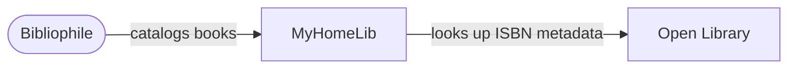
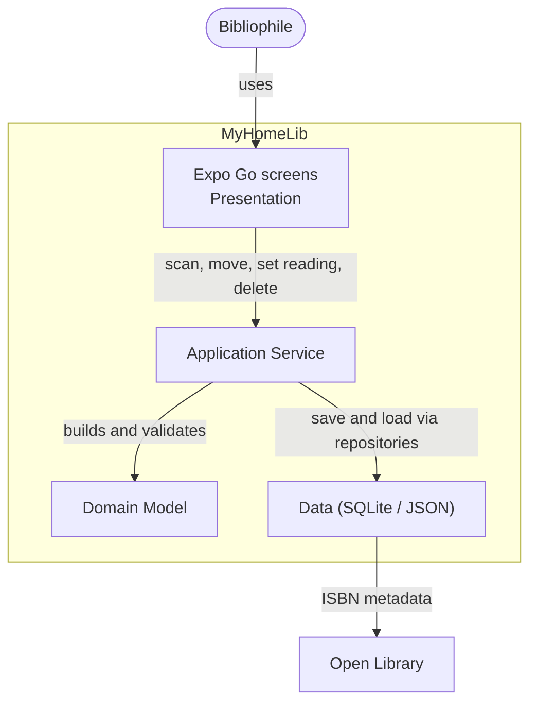
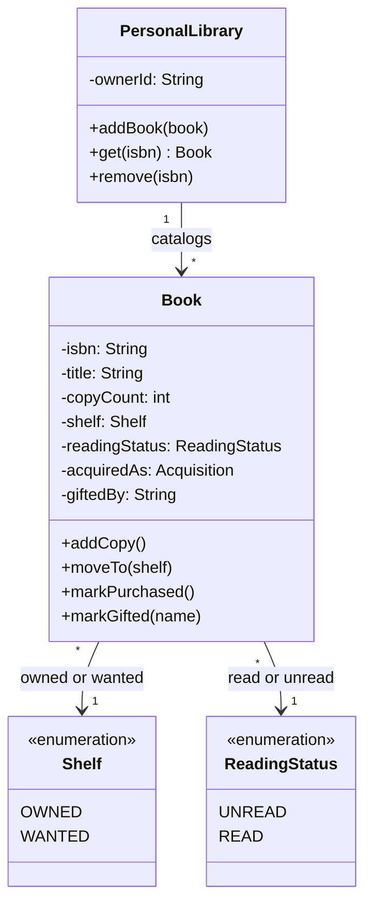
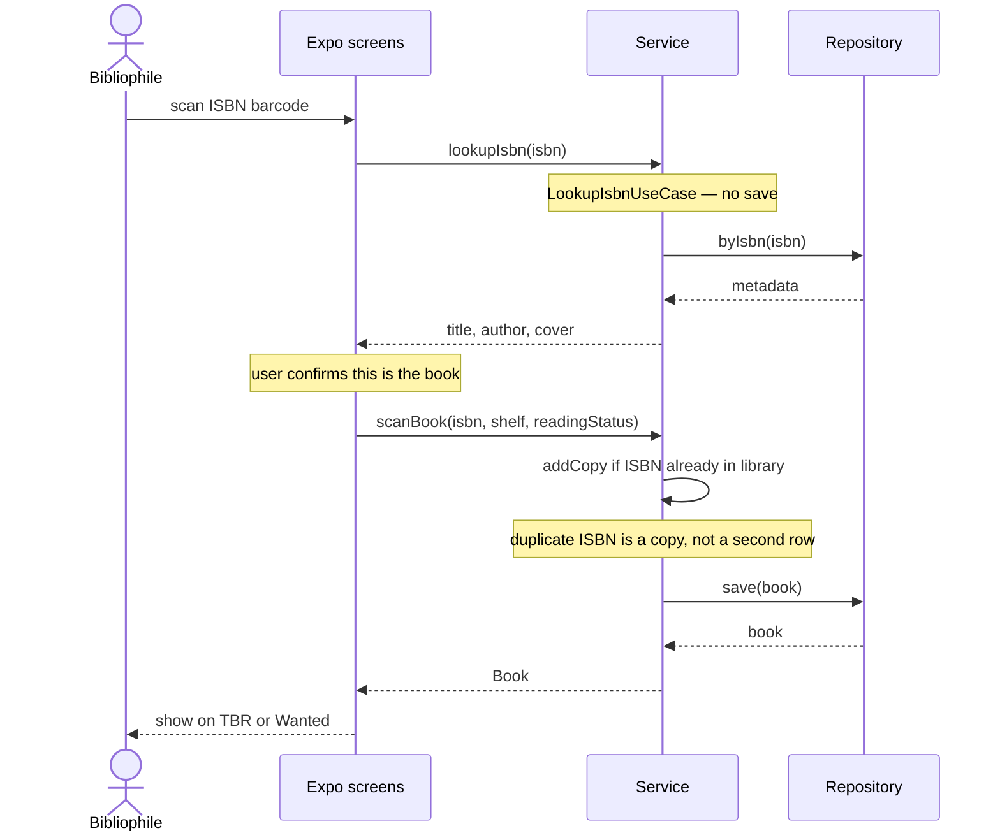

# MyHomeLib

**Student:** Grace Hechavarria · **Course:** CEN 5064 Software Design, Fall 2026 · **Partner:** [@YousufTheSWE]

## Project (approval paragraph)

```
MyHomeLib is a cross-platform Expo Go app (React Native) for bibliophiles who catalog a personal library. It runs on iPhone and Android through the free Expo Go client — not an App Store / Play binary, and not an Xcode or Android Studio project — so a partner can clone the repo and run it without a Mac. Conference fallback: Expo web in a browser (webcam ISBN scan). Core features: (1) ISBN camera scan (typed ISBN fallback) that looks up metadata from Open Library (the only external integration; no API key), including series, description, year, pages, and subjects, (2) Owned vs Wanted, with TBR as the Owned unread/read list and an Owned catalog (A–Z / author / series), and (3) Domain rules: scanning an ISBN already in the library increments a copy count instead of adding a second row; a Wanted book cannot move to Owned unless it is marked purchased or gifted (gifted requires the giver’s name). There is no bookstore web scraping.
```

## How to run

Requires Node.js LTS. No Python, no Xcode, no Android Studio, no paid developer account.

```
npm install
npm start
```

- Phone: install free **Expo Go**, then scan the QR code (same Wi-Fi, or use the tunnel option Expo prints). Open **Scan** and allow the camera; point it at the ISBN barcode on the book.
- No phone: in the Expo terminal press `w` (or `npm start -- --web`). Allow the webcam, or type the ISBN.

Tests: `npm test`.

## Architecture

### Tier breakdown (Session 2 studio)

| Tier | Responsibilities in THIS system |
|------|--------------------------------|
| Presentation | Expo Go screens: bottom menu **TBR / Owned / Wanted / Scan**. Dark forest theme. TBR is the Owned reading list (Unread / Read tabs). Owned is the full catalog (tally; A–Z letter rail, Author, or Series from Open Library). Wanted is the wanted list. Scan uses the device camera or web webcam outside a ScrollView; lookup shows a cover confirm popup, then Owned/Wanted and Read/Unread (skipped for a duplicate ISBN); typed ISBN fallback. Detail: Open Library facts, mark read/unread, Wanted → Owned (purchased/gifted popups), delete with confirm. Flash banners auto-dismiss after 3 seconds. Calls `LookupIsbnUseCase` / `ScanBookUseCase` / `MoveBookToShelfUseCase` / `SetReadingStatusUseCase` / `DeleteBookUseCase`. |
| Service | Orchestration. `LookupIsbnUseCase` (no save) then `ScanBookUseCase` after UI confirm; also `MoveBookToShelfUseCase`, `SetReadingStatusUseCase`, `DeleteBookUseCase`. Duplicate ISBN increments copies. Service never contains SQL, `fetch`, or React. |
| Domain | `Book` (isbn, title, author, cover, publisher, shelf OWNED/WANTED, readingStatus UNREAD/READ, series, description, published, pageCount, subjects, copyCount, acquiredAs, giftedBy). TBR is a view of Owned unread/read, not a third exclusive shelf. Wanted→Owned requires purchased or gifted. |
| Data | Persistence and the single external integration. On a phone, `SqliteBookRepository` (`expo-sqlite`) stores each owner’s books plus Open Library cache (series, description, year, pages, subjects). Legacy TBR rows migrate to Owned + unread; old collection names copy into series. On Expo web / tests, JSON/memory. `OpenLibraryIsbnLookup` is the only outbound HTTP (`search.json` + `isbn/{isbn}.json` + work JSON when series is missing, no API key). No bookstore scraping. |

### C4 — Context & Container (Session 3 studio)

**Context** — what this is and who it is for. One system box, the person who uses it, and the external systems it talks to. Internals (SQLite, Expo, shelves) belong at Container.



**Container** — the Lecture 1 four-tier table made concrete. Calls flow Presentation → Service → Domain and Data, never backwards. Domain does not depend on Data.



### UML — Class & Sequence (Session 3 studio)

**Class diagram** — four core domain types with the attributes the rules use. Duplicate ISBN increments copies; leaving Wanted requires purchased or gifted; read/unread is independent of Owned/Wanted.



**Sequence diagram** — #1 use case: lookup (no save) → UI confirm → ScanBookUseCase save. `->>` is a call, `-->>` is a return. Participants are UI / Service / Repository.



## Architecture Decision Records

Decisions live in [`docs/adr/`](docs/adr/). File walkthrough for code review: [`docs/code-review.md`](docs/code-review.md).

| # | Decision | Status |
|---|----------|--------|
| [001](docs/adr/adr-001.md) | TypeScript + Expo Go 4-tier monolith | accepted |
| [002](docs/adr/adr-002.md) | SQLite (device) / JSON fallback (web) | accepted |
| [003](docs/adr/adr-003.md) | Open Library for ISBN (no key) | accepted |
| [004](docs/adr/adr-004.md) | No bookstore scraping | accepted |
| [005](docs/adr/adr-005.md) | Expo Go, not App Store / Xcode | accepted |

## Weekly log (optional but recommended)

- Week 1 (Aug 24): repo created, three ideas drafted
- Week 2 (Aug 31): Tier Breakdown  
- Week 3 (Sep 07): C4 Models / Architecture
- Week 4 ( Break ) ...
- Week 5 (Sep 21): Initial Architecture/Logic and Design Creation #3 Issue created. Changes pushed to a PR for review.
